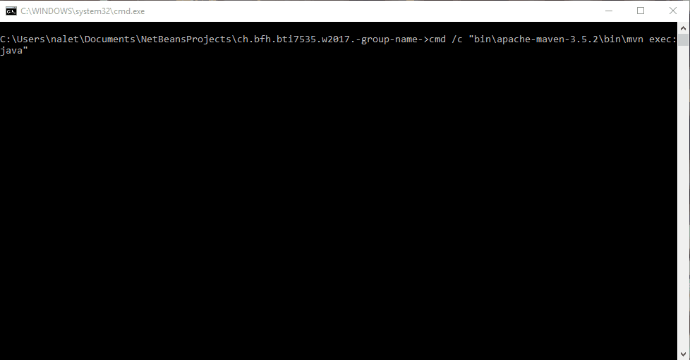

# DataScience

Content from course of Bern University of Applied Sciences by ©Jürgen Vogel

This peace of software was made during the data scinece course.

# Documentation

A javadoc and the final presentation for the course can be found in the `docs` folder.

# Run

How do you run the software? Java (JRE or JDK) is at least to be installed on your local computer. For running the application you can execute either the `run.bat` for Windows or the equivalent `run.sh` for Linux or Mac.

If you done everything, you schould be able to see a console menu like in the picture above.

# Manual

You can run the sentiments in the program by choosing its number. The menu point `Validation` executes the generated feautures againts the gold standard and outputs the accuracy of it.