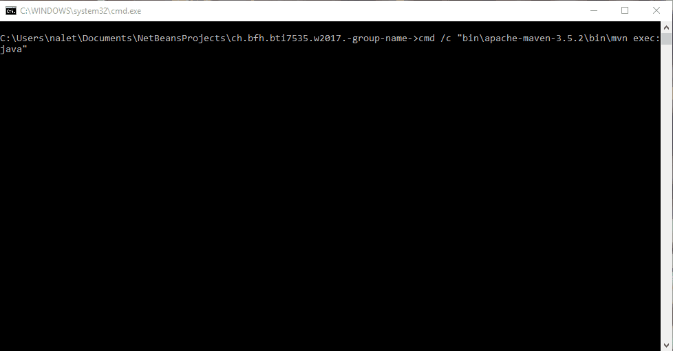

# DataScience

Content from course of Bern University of Applied Sciences by ©Jürgen Vogel

This piece of software was made during the data science course.

# Documentation

A javadoc and the final presentation for the course can be found in the `doc` folder.

Direct links:

* https://nussa2.github.io/ch.bfh.bti7535.w2017.-group-name-/doc/java-docs
* https://nussa2.github.io/ch.bfh.bti7535.w2017.-group-name-/doc/Presentation.pdf 

# Run

Build with maven or your prefered IDE. Execute App and have fun! 

If you did everything correctly, you should be able to see a console menu like in the picture above.

# Manual

You can run the sentiments in the program by choosing its number. The menu point `Validation` executes the generated features against the gold standard and outputs the accuracy of it.